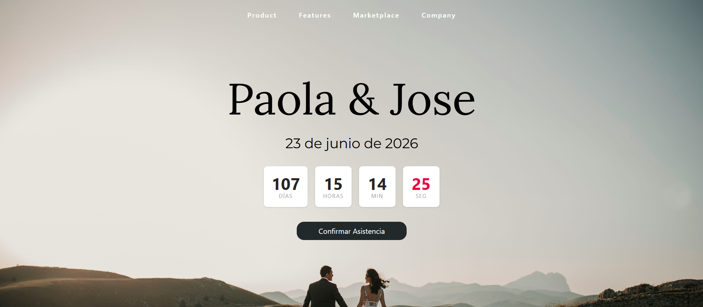

# 💍 Wedding Invitation - Digital Landing Page

Una invitación de boda digital moderna, rápida y elegante construida con **Astro**. Diseñada para ofrecer una experiencia fluida a los invitados, optimizada para dispositivos móviles y con un enfoque en el rendimiento.

---

## ✨ Características principales

- 🚀 **High Performance:** Construido con Astro para una carga instantánea (ideal para redes móviles).
- ⏳ **Countdown Timer:** Contador regresivo dinámico en tiempo real hasta el gran día.
- 📱 **Mobile First:** Diseño 100% responsivo para una visualización perfecta en smartphones.
- 📍 **Ubicación Inteligente:** Integración con Google Maps y Waze para navegación directa.

## 📂 Secciones del Proyecto

- **Hero & Nav:** Presentación de impacto con navegación fluida.
- **Cuenta Regresiva:** Bloque dinámico de días, horas y minutos.
- **Detalles del Evento:** Información clara sobre ceremonia y recepción.
- **Confirmación (RSVP):** Acceso directo para confirmar asistencia.

## 🛠️ Stack Tecnológico

- **Framework:** [Astro](https://astro.build/)
- **Estilos:** [Tailwind CSS](https://tailwindcss.com/)
- **Lógica:** JavaScript Nativo

---

Hecho con ❤️ por [josergz](https://github.com/josergz)
